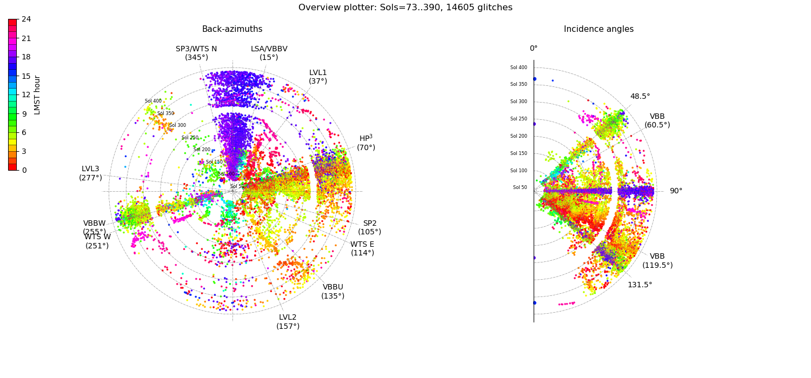

.. _plot:

seisglitch plot
===============

The plot function allows to plot the :ref:`detected glitches <detect>` in different ways.
Most of the plots available correspond to the plots shown in `Scholz et al`_, (2020_) and its Supplementary Information 2.
The idea is to input the glitch detector files coming from the detect function 
(one file, multiple files, or multiple files :ref:`merged <merge>` into one),
subsequently select those glitches you are interested in (e.g. horizontal polarizations only), and finally specify 
which plots shall be generated (see `run` option for each plot).
More information are given in the config.yml file.

After having entered the `plot` options in the ``config.yml``,
run the plot function from terminal like so:
::

    seisglitch plot path/to/config.yml

The following plots show the VBB glitches detected for 2019, produced via the option ``glitch_overview_plot``.
The used list of glitches is not distributed as part of this package but a 
similar one is published in the Supplementary Information 1.
In interactive mode you could click on the colored dots and information about the chosen glitch are printed
into shell. Additionally a plot showing the glitch polarization is opened.

.. image:: _static/overview_glitch_2.png
    :alt: glitch polarization sphere and histogram

.. _Scholz et al: https://www.essoar.org/doi/10.1002/essoar.10503314.2
.. _2020: https://www.essoar.org/doi/10.1002/essoar.10503314.2